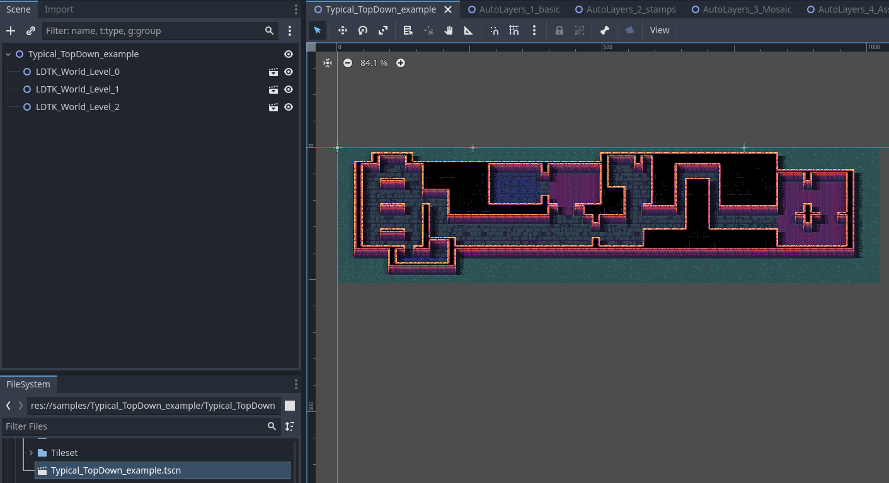
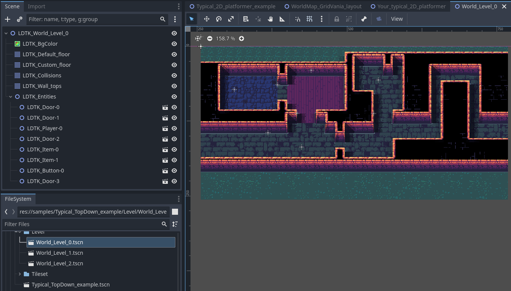

# Godot LDtk C# Importer

Godot 4 C# [LDtk](https://ldtk.io/) 导入插件

 

> ⚠️ 目前该插件仍处于开发阶段，许多特性还处于调整中，请勿将本插件应用于生产环境！在使用本插件前，请确保已经对项目文件进行备份！

# 📖 安装

1. 使用C#版Godot 4.2+
2. 将`addons\LdtkImporter`目录放到项目的`addons`目录下
3. 通过 `Project > Project Settings > Plugins`开启本插件
4. 此时`.ldtk`文件可以被Godot识别，并且会自动导入，并生成对应的`.tscn`场景资源和`.tres`Tileset资源

# ✨ 特性

## 🌏 World

- [x]`.ldtk`文件导入后生成同名的`.tscn`场景，内部包含所有的`关卡`节点 ⬇️

## 🏔️ Level

- [x] LDTK`Level`导入后，生成同名的`关卡`场景 ⬇️
- [x] `关卡`场景独立导出为`.tscn`文件

## 📄 Layer
- [x] `AutoLayer`、`IntGrid`类型Layer生成为Godot TileMap，`Entity`类型Layer生成为Godot Node2D
- [x] 支持将 `IntGrid` 作为子节点生成 ⬇️

- [x] 支持同一个`Layer`下多个Tile叠加

## 🧱 Tilesets
- [x] 为每个 LDTK Tilesets
  生成 [TileSetAtlasSource](https://docs.godotengine.org/en/stable/classes/class_tilesetatlassource.html#class-tilesetatlassource)
  样式的 Godot Tileset
- [x] 支持 [Tile](https://ldtk.io/json/#ldtk-Tile;f) X轴/Y轴翻转，并为其生成专门的 `AlternativeTile`

## 🐸 Entity
- [x] 为每个Entity生成一个

# 🚩 导入选项
当在Godot的`FileSystem`选中一个`.ldtk`文件时，可以看到如下图所示的导入选项： ⬇️

* General
    * Prefix: 该前缀表示当执行导入时，生成的 `Node2D`、`TileMap`等节点的名称前缀（例如：`LDTK_World_Level_0`）以及导入的元数据的名称前缀
* World
    * World Scenes: 表示要生成的世界场景的文件名称
* Tileset
    * Add Tileset Definition to Meta: 将所有 [LDTK Tileset definition](https://ldtk.io/json/#ldtk-TilesetDefJson)数据作为元数据存储到Godot tileset中，其中元数据的key为：`${Prefix}_tilesetDefinition`，例如：`LDTK_tilesetDefinition`
    * Resources: 根据LDTK中Tilesets的不同，插件自动生成对应的配置
* Entity
    * Add Entity Definition to Meta: 将[LDTK Entity Definition](https://ldtk.io/json/#ldtk-EntityDefJson)数据作为元数据存储到导入后的Entity Scene以及节点中，其中元数据的key为：`${Prefix}
      _entityDefinition`，例如：`LDTK_entityDefinition`
    * Add Entity Instance to Meta: 将[LDTK Entity Instance](https://ldtk.io/json/#ldtk-EntityInstanceJson)数据作为元数据存储到导入后的Entity节点中，其中元数据的key为：`${Prefix}_entityInstance`，例如：`LDTK_entityInstance`
    * Scenes: 根据LDTK中Entity的数量，插件自动生成对于的配置
* Level
    * Add Level to Meta: 将[LDTK Level](https://ldtk.io/json/#ldtk-LevelJson)数据作为元数据存储到导入后的Level节点中，其中元数据的key为：`${Prefix}_levelInstance`，例如：`LDTK_levelInstance`
    * Add Layer Instance to Meta: 将[LDTK Layer Instance](https://ldtk.io/json/#ldtk-LayerInstanceJson)数据作为元数据存储到导入后的Layer节点中，其中其中元数据的key为：`${Prefix}_layerInstance`，例如：`LDTK_layerInstance`
    * Add Layer Definition to Meta: 将[LDTK Layer Definition](https://ldtk.io/json/#ldtk-LayerDefJson)数据作为元数据存储到导入后的Layer节点中，其中其中元数据的key为：`${Prefix}_layerDefinition`，例如：`LDTK_layerDefinition`
    * Import Int Grid: 是否导入`IntGrid`，效果参考[Layer](#-layer)中动图展示
    * Scenes: 根据LDTK中Level的不同，插件自动生成对应的配置

# ❓FAQ
## LDTK支持在同一个Layer内的同一个位置堆叠多个[tile instance](https://ldtk.io/json/#ldtk-LayerInstanceJson;autoLayerTiles)，当导入到Godot时，是如何处理的？
Godot TileMap支持创建多个 [Layer](https://docs.godotengine.org/en/stable/tutorials/2d/using_tilemaps.html#creating-tilemap-layers)
，在导入时，插件会算出当前Layer的最大堆叠数量并在TileMap中提前将这些Layer创建出来，同时还会更新每个 [tile instance](https://ldtk.io/json/#ldtk-Tile) 在TileMap中的Layer图层索引。在真正执行导入时，已经就知道每个LDTK tile 
instance归属于哪个TileMap Layer。一句话总结：通过Godot TileMap支持多Layer的特性解决堆叠问题。

## 如果使用该插件作为LDTK和Godot的桥梁，那么工作流应该是怎样的？
本插件作者一直在思考该问题，且还没要找到完美的解决方案。在LDTK和Godot结合的工作流中，LDTK的主要作用地图编辑器，然而并不能在LDTK中完成所有的地图编辑工作，例如需要为TileSet
配置物理碰撞、导航时，也有可能在导入后对`tscn`场景进行编辑修改。这导致了一个核心矛盾点的产生：`如何解决重复导入而不影响在Godot中所做修改。`，目前有一个初步想法：
1. 不支持重复导入，每次导入都覆盖原来的资源（Tileset、Scene）
2. 支持重复导入
   1. 在导入时，假如原资源（Tileset、Scene等）已经存在，在原数据的基础上修改
   2. 通过前缀名区分节点是`用户节点`还是`LDTK节点`，也用来区分是`用户元数据`还是`LDTK元数据`

目前插件选用的是方案1的思路，如果有更好的思路，欢迎一起探讨！

# 💣 TODO

- [ ] 运行时
  - [ ] 支持运行动态修改`IntGrid`，并根据 [LDTK Auto-layer rule definition](https://ldtk.io/json/#ldtk-AutoRuleDef) 实时更新并渲染受影响的`IntGrid`和`AutoLayer`
- [ ] World
  - [ ] 导入后处理脚本支持
  - [ ] LDTK [Multi-worlds](https://github.com/deepnight/ldtk/issues/231) 支持
  - [x] LDTK 默认`Level`背景色支持
- [ ] Level
  - [x] 支持`Level`背景色和背景图的导入
  - [x] LDTK Level fields支持，元数据名称为：$"{prefix}_fieldInstances"
  - [ ] 支持Level配置开关：是否生成独立的Level场景
  - [ ] `Level` 导入后处理脚本支持
- [ ] Entity
  - [ ] Entity视觉显示支持（`Sprite2D`）
  - [ ] `Entity`导入后处理脚本支持
  - [ ] Enum支持

# 🐞 已知BUG
- [ ] 每次重新导入后，需要重新`Reload Current Project`或重新打开Godot后，导入的`.tscn`才会生效
- [ ] 当`IntGrid`不包含rules时，生成的TileMap节点中没有包含TileSet，并且也没有正确设置tile
- [ ] 每次重新导出时，导出的`tscn`文件都有变化（主要是Level场景的id发生变化）
- [x] 官方示例：Typical_TopDown_example.ldtk，导入后，某些Tile会缺失
- [x] 目前导入后，没有为Level设置背景色
- [x] 打开某些导入后的场景和Tileset后，会导致Godot闪退（例如：Typical_TopDown_example.ldtk）